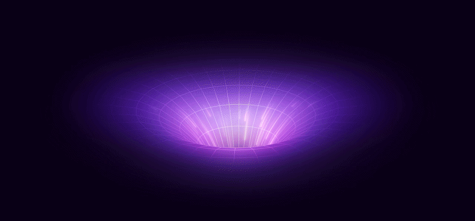

  
  
  <h1>Tanishq Agrawal | The 3D Web Experience</h1>
  
  

    <strong>An ultra-premium, high-performance WebGL portfolio pushing the boundaries of frontend engineering and immersive design.</strong>
  

  

    
  

   

 

---

## 👨‍💻 The Engineer Behind the Screen

<table border="0" cellpadding="10" cellspacing="0" width="100%">
  <tr>
    <td width="50%" valign="middle">
      
I am <strong>Tanishq Agrawal</strong>, a passionate <strong>B.Tech Computer Science student</strong> specializing in cutting-edge web technologies, advanced 3D frontend development, and crafting highly interactive web applications.

      
This portfolio is not just a resume; it is a <strong>technical demonstration</strong> of what is possible when combining mathematics, physics, and modern web frameworks. My goal was to break away from traditional static scrolling websites and create a spatial, game-like experience that leaves a lasting impression on every visitor.

    </td>
    <td width="50%" valign="middle" align="center">
      
    </td>
  </tr>
</table>

---

## ✨ Deep Dive into Premium Features

### 🌌 Immersive 3D Spatial Environment
The core of this portfolio is powered by **Three.js** and **React Three Fiber**. Instead of reading a flat page, users navigate through a 3D environment.
- **Custom Shaders:** Utilizing WebGL for high-performance rendering.
- **Dynamic Lighting:** Real-time shadows, neon glows, and ambient lighting that reacts to the environment.

### 🧲 Advanced Magnetic Physics & GSAP
Interactive elements on the page don't just sit there—they feel alive.
- **Hover Physics:** Buttons and text elements feature magnetic attraction boundaries, pulling towards the user's cursor.
- **GSAP Animations:** Silky-smooth 60FPS animations handled by the GreenSock Animation Platform, ensuring that every transition feels cinematic.

### 💎 Glassmorphism & Cyberpunk Aesthetics
A meticulously crafted UI/UX that blends futuristic elements with modern minimalism.
- **Frosted Glass:** CSS backdrops with precise blur and transparency layers.
- **Neon Gradients:** Custom color palettes (deep blacks, purples, and blues) that create a premium "dark mode" feel.
- **Fluid Typography:** Fonts that dynamically scale and shift based on viewport dimensions.

### ⌨️ "Type With Me" Gamification Challenge
To make the portfolio truly memorable, I built a fully functional typing minigame directly into the site.
- **MonkeyType Logic:** Real-time WPM (Words Per Minute) calculations.
- **Recruiter Challenge:** A 60-second sprint designed to engage visitors and showcase logic-building skills alongside design.

---

## 🧰 The Architectural Stack

This project is engineered for speed, scalability, and visual fidelity using a robust modern tech stack:

| Technology | Purpose in Project |
| :--- | :--- |
|  | Component architecture, state management, and lifecycle handling. |
|  | Core 3D engine for rendering WebGL graphics and handling 3D math. |
|  | Complex timeline animations and physics-based interactions. |
|  | Strict type-checking to ensure a bug-free, maintainable codebase. |
|  | Ultra-fast Hot Module Replacement (HMR) and optimized production builds. |

---

## ⚡ Performance Optimization

Building a 3D website can be resource-heavy. Here is how I ensured it remains lightning fast:
1. **Lazy Loading:** 3D models and textures are loaded asynchronously so the main thread isn't blocked.
2. **Geometry Instancing:** Reusing 3D geometries to reduce draw calls to the GPU.
3. **Optimized Assets:** All images and videos (`.webm`) are heavily compressed for the web.

---

## 🤝 Let's Collaborate

I am currently open to exciting opportunities, internships, and collaborative projects that challenge the status quo of web development. Let's build something extraordinary together.

 

| | Connect |
|:---:|:---|
| 🌐 | **Portfolio** — See my work live →  |
| 💻 | **GitHub** — Explore my open source projects →  |
| 📧 | **Contact** — Let's start a conversation →  |

 

---

  
Engineered with pixel-perfect precision and ❤️ by <strong>Tanishq Agrawal</strong>

  
<em>© 2026. All rights reserved.</em>

